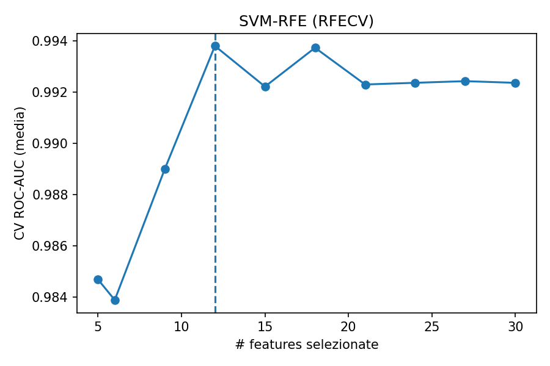
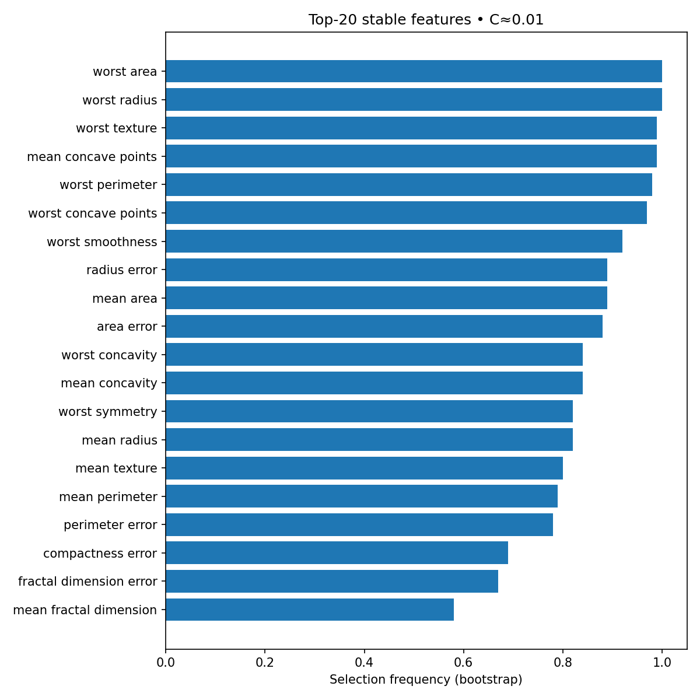

# SVM-RFE (Breast Cancer) — Demo rigorosa


Selezione di feature con **SVM-RFE (LinearSVC)** su dataset pubblico *Breast Cancer Wisconsin (Diagnostic)*.

## Risultati (TL;DR)

**RFE (5-fold, demo)**
- **#feature selezionate:** 12  
- **ROC-AUC (media ± std):** **0.985 ± 0.016**  
- **Figure**  
  - Curva **#feature vs AUC**  
    
  - **Top coefficienti** SVM (dopo RFE)  
    

**Nested CV + Stabilità**
- Outer CV (stima onesta): **Accuracy / F1 / ROC-AUC** in `results/summary.json`  
- **Stabilità** (bootstrap, 100× @ 0.8): frequenza di selezione per feature in `results/features_selected.csv`  
  

> Gli artifact con gli output si possono scaricare dalla pagina **Actions** del repository.

---

## Perché interessante
- **p≫n classico**: SVM-RFE è uno standard su dati ad alta dimensionalità (bio/omics).
- **Rigoroso**: preprocessing **in-pipeline** (no leakage), **CV stratificata**, nested CV per tuning.
- **Interpretabile**: coefficienti lineari e **stabilità** di selezione (bootstrap).

---

## Esecuzione rapida

> Python consigliato: **3.11/3.12**.

```bash
# 1) Ambiente
python3 -m venv .venv && source .venv/bin/activate
pip install -U pip wheel
pip install -r requirements.txt

# 2) Demo RFE (usa il dataset integrato di scikit-learn)
python src/rfe_simple.py --min_features 5

# 3) Nested CV + Stabilità
python src/rfe_nested_stability.py --min_features 5 --n_outer 5 --n_repeats 100 --subsample 0.8
