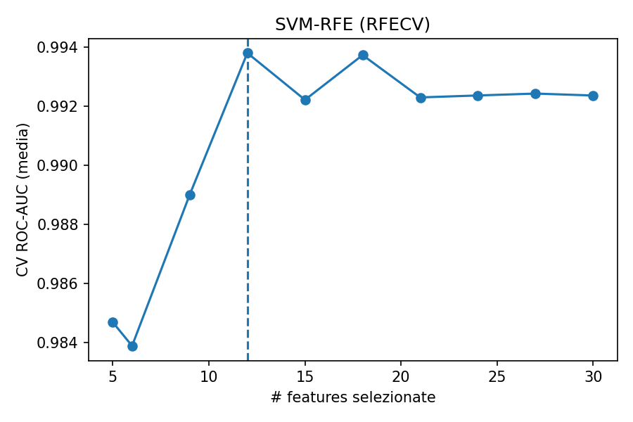
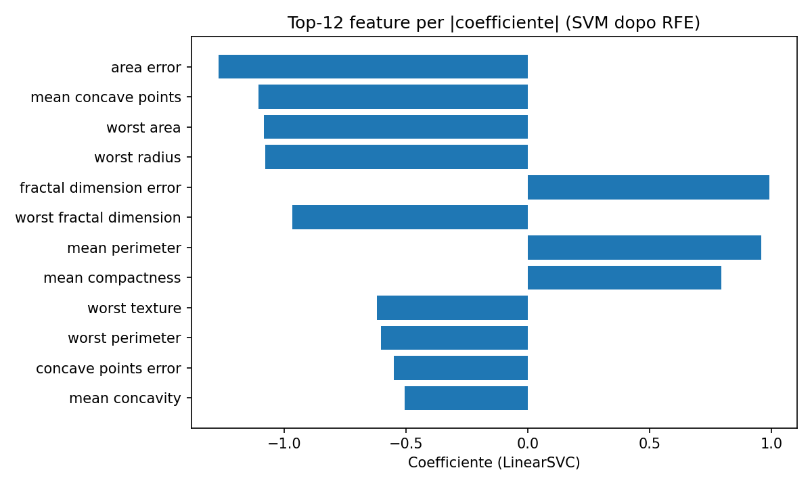
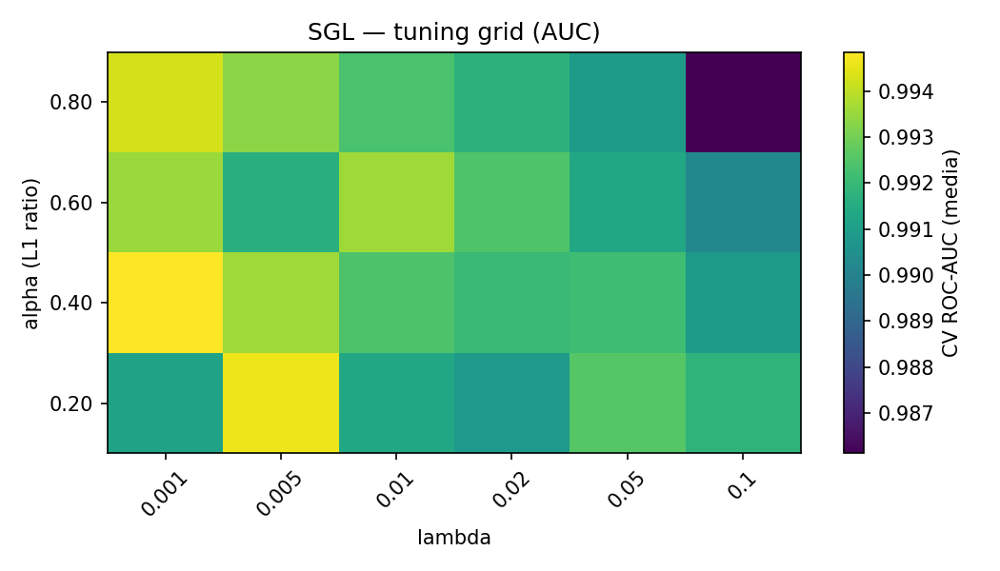
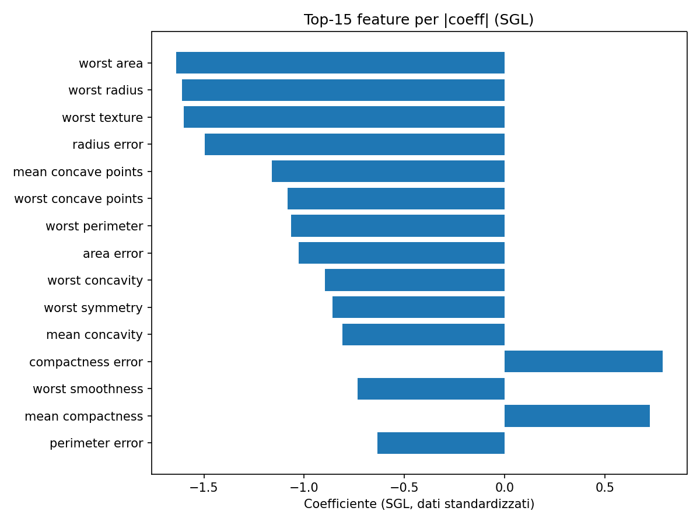
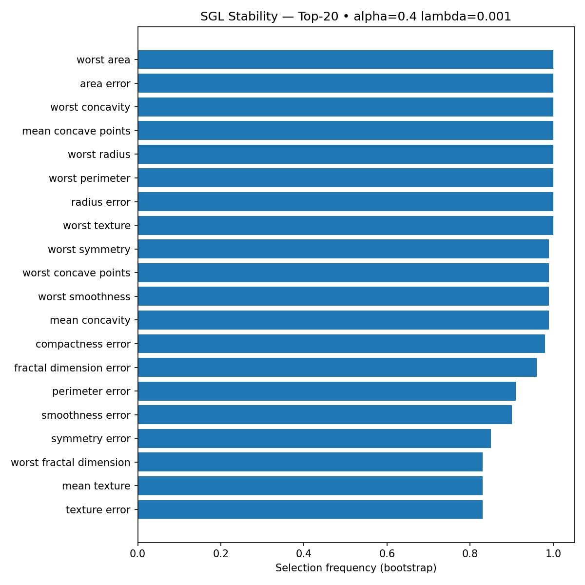

# Feature Selection Playbook — Breast Cancer (sklearn)


Selezione di feature su *Breast Cancer Wisconsin (Diagnostic)* con metodi **classici ma rigorosi**, risultati riproducibili (Makefile + CI) e grafici pronti da mostrare.

---

## Risultati (TL;DR)

### SVM-RFE (wrapper con SVM lineare)
- **#feature selezionate:** 12  
- **ROC-AUC (5-fold, media ± std):** **0.985 ± 0.016**
- **Figure**
  - Curva **#feature vs AUC**  
    
  - **Top coefficienti** SVM (dopo RFE)  
    
  - **Stabilità** (bootstrap 100× @ 0.8)  
    

### Sparse Group Lasso (SGL)
- **ROC-AUC (5-fold, media ± std):** **0.994 ± 0.006**  
- **Best params:** α (L1-ratio) = **0.4**, λ = **0.001**  
- **Gruppi usati:** `mean` / `error` / `worst` / `other` (derivati dal nome della feature)
- **Figure**
  - Mappa **AUC** su (α, λ)  
    
  - **Top coefficienti** (feature attive, |coef| più alto)  
    
  - **Stabilità** (Top-20 selection frequency)  
    


---

## Confronto metodi

| Metodo   | AUC (±std)     | #feature attive* | Note                                  |
|---------:|:---------------|:-----------------|:--------------------------------------|
| SVM-RFE  | **0.985 ± 0.016** | 12              | Wrapper + RFECV, ottimo ginocchio a 12 |
| **SGL**  | **0.994 ± 0.006** | vedi `sgl_summary.json` | Embedded: gruppi + sparsità L1        |


---

## Esecuzione rapida

> Python consigliato: **3.11 / 3.12** (ok anche 3.13 con le versioni attuali dei pacchetti).

```bash
# 1) Ambiente
python3 -m venv .venv && source .venv/bin/activate
pip install -U pip wheel
pip install -r requirements.txt

# 2) RFE (demo) — usa dataset integrato sklearn
python src/rfe_simple.py --min_features 5

# 3) RFE avanzato: nested CV + stabilità
python src/rfe_nested_stability.py --min_features 5 --n_outer 5 --n_repeats 100 --subsample 0.8

# 4) SGL (gruppi mean/error/worst) + stabilità
python src/sgl_stability.py --n_repeats 100 --subsample 0.8

